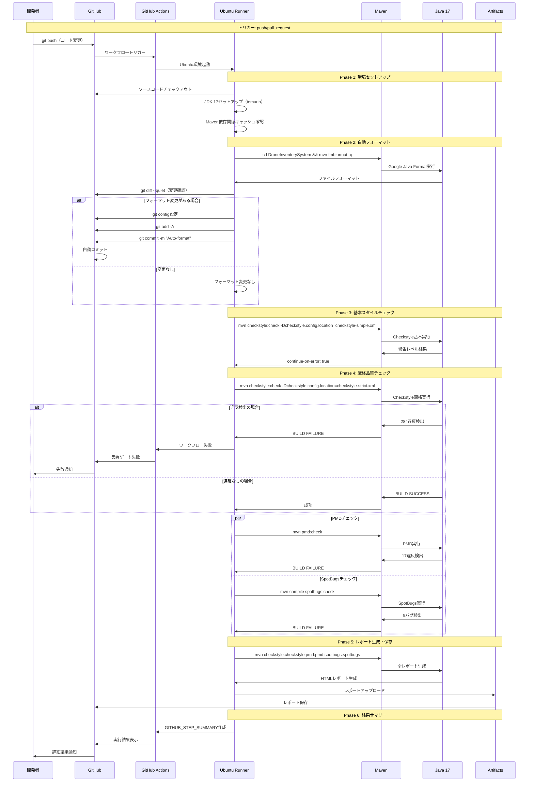
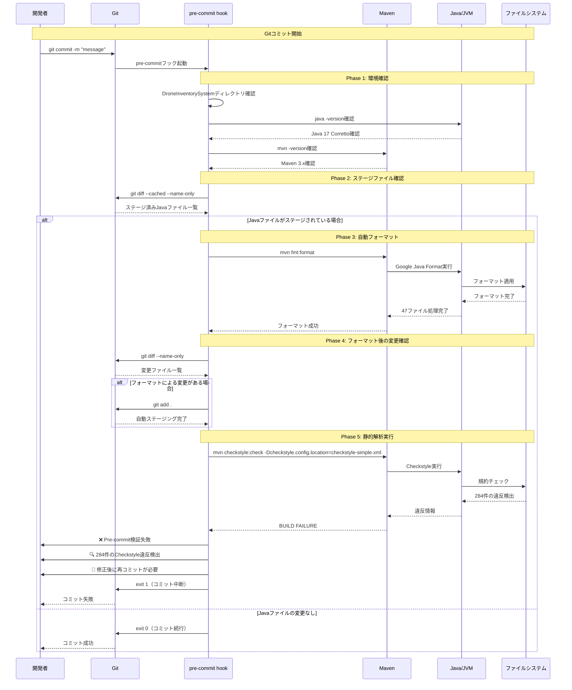
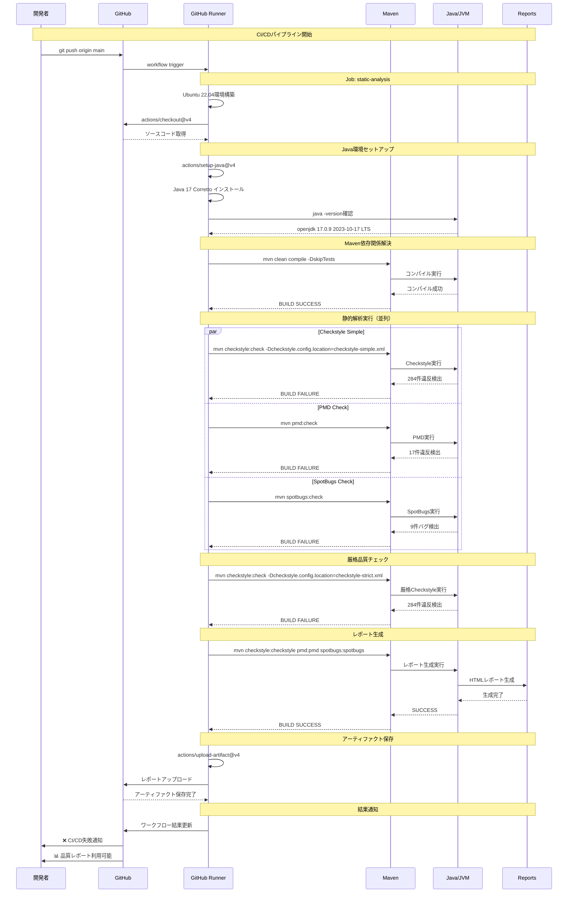
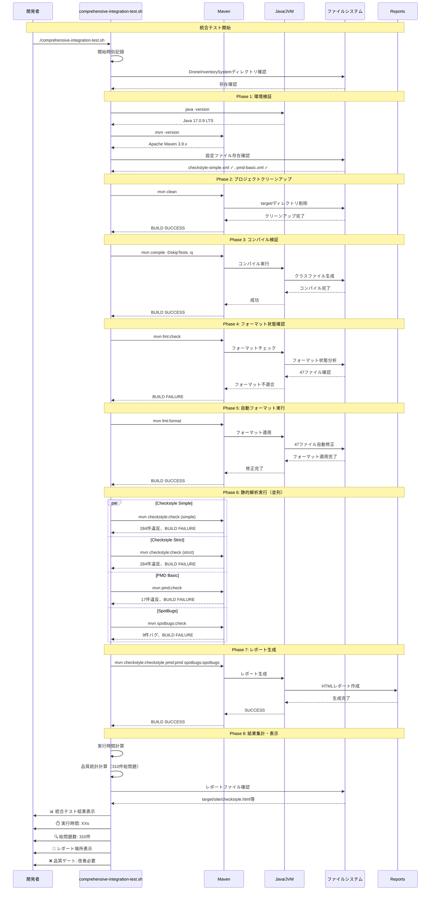
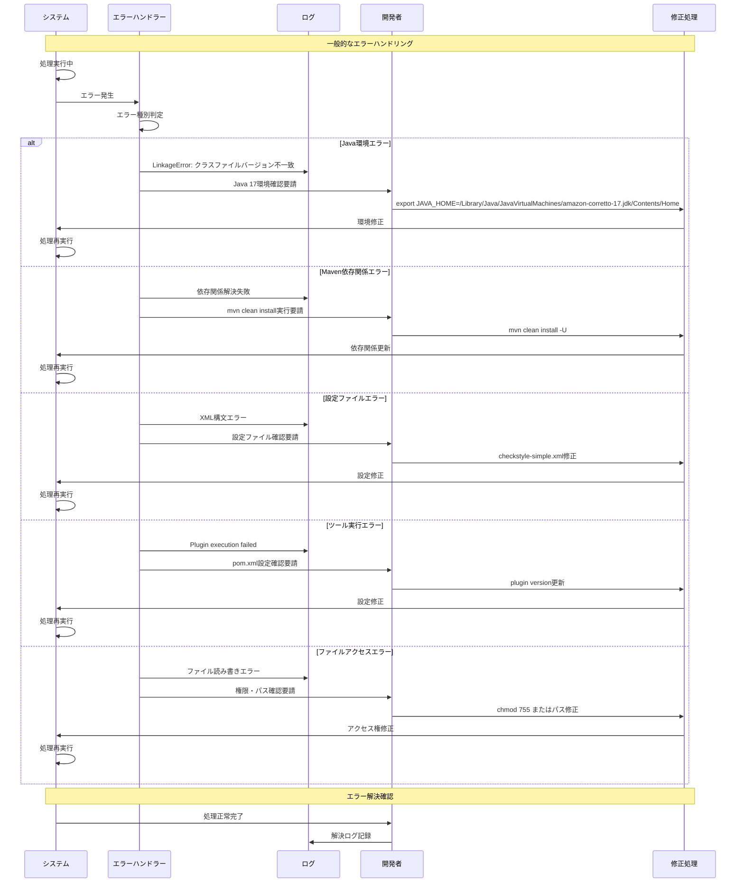
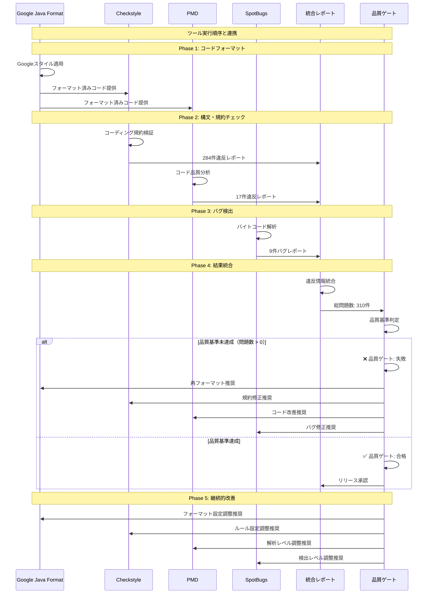

# 静的解析システム 包括的動作フローシーケンス図

## 概要
DroneInventorySystemプロジェクトにおける静的解析ツール統合の詳細な動作フローを表現したシーケンス図です。手動実行、自動化、CI/CD統合のすべてのフローを網羅しています。

## 目次
- [静的解析システム 包括的動作フローシーケンス図](#静的解析システム-包括的動作フローシーケンス図)
  - [概要](#概要)
  - [目次](#目次)
  - [1. 手動実行フロー（manual-static-analysis.sh）](#1-手動実行フローmanual-static-analysissh)
  - [2. CI/CD自動実行フロー（GitHub Actions）](#2-cicd自動実行フローgithub-actions)
  - [3. Pre-commitフック実行フロー](#3-pre-commitフック実行フロー)
  - [4. GitHub Actions CI/CDフロー](#4-github-actions-cicdフロー)
  - [5. 統合テストフロー（comprehensive-integration-test.sh）](#5-統合テストフローcomprehensive-integration-testsh)
  - [6. エラーハンドリングフロー](#6-エラーハンドリングフロー)
  - [7. ツール間連携フロー](#7-ツール間連携フロー)
  - [まとめ](#まとめ)
    - [主要なフロー](#主要なフロー)
    - [検出される品質問題](#検出される品質問題)
    - [次のステップ](#次のステップ)

## 1. 手動実行フロー（manual-static-analysis.sh）

```mermaid
sequenceDiagram
    participant Dev as 開発者
    participant Script as manual-static-analysis.sh
    participant Maven as Maven
    participant Java as Java/JVM
    participant Git as Git
    participant Files as ファイルシステム
    
    Note over Dev, Files: Phase 1: 環境確認・準備
    Dev->>Script: ./manual-static-analysis.sh 実行
    Script->>Files: DroneInventorySystemディレクトリ存在確認
    Files-->>Script: 存在確認結果
    Script->>Git: pre-commitフック状態確認
    Git-->>Script: フック状態返却
    
    alt pre-commitフック有効の場合
        Script->>Dev: 無効化確認プロンプト
        Dev->>Script: y/n選択
        Script->>Git: pre-commit → pre-commit.backup
        Git-->>Script: 無効化完了
    end
    
    Note over Dev, Files: Phase 2: フォーマット状態確認
    Script->>Dev: Phase 1実行確認
    Dev->>Script: Enter（実行）
    Script->>Maven: mvn fmt:check
    Maven->>Java: Google Java Format実行
    Java->>Files: フォーマット状態チェック
    Files-->>Java: フォーマット違反情報
    Java-->>Maven: 違反数・詳細
    Maven-->>Script: 実行結果（exit code）
    Script->>Dev: 結果表示・次フェーズ確認
    
    Note over Dev, Files: Phase 3: 自動フォーマット実行
    Dev->>Script: Enter（実行）
    Script->>Maven: mvn fmt:format
    Maven->>Java: Google Java Format実行
    Java->>Files: ファイル自動修正
    Files-->>Java: 修正完了
    Java-->>Maven: フォーマット済みファイル数
    Maven-->>Script: 実行結果
    Script->>Dev: フォーマット結果表示
    
    Note over Dev, Files: Phase 4: フォーマット差分確認
    Dev->>Script: Enter（実行）
    Script->>Git: git diff --name-only
    Git->>Files: 変更ファイル検索
    Files-->>Git: 変更ファイル一覧
    Git-->>Script: 差分ファイル一覧
    Script->>Dev: 変更ファイル表示
    
    Note over Dev, Files: Phase 5: コンパイルチェック
    Dev->>Script: Enter（実行）
    Script->>Maven: mvn compile -DskipTests -q
    Maven->>Java: Javaコンパイル
    Java->>Files: .classファイル生成
    
    alt Lombokエラーの場合
        Java-->>Maven: コンパイルエラー
        Maven-->>Script: BUILD FAILURE
        Script->>Dev: Lombokエラー表示（予期される）
    else 正常コンパイル
        Files-->>Java: コンパイル完了
        Java-->>Maven: BUILD SUCCESS
        Maven-->>Script: 成功
        Script->>Dev: コンパイル成功表示
    end
    
    Note over Dev, Files: Phase 6: 基本スタイルチェック
    Dev->>Script: Enter（実行）
    Script->>Maven: mvn checkstyle:check -Dcheckstyle.config.location=checkstyle-simple.xml
    Maven->>Java: Checkstyle実行
    Java->>Files: checkstyle-simple.xml読み込み
    Java->>Files: ソースコード解析
    Files-->>Java: 違反情報
    Java-->>Maven: 警告レベル違反
    Maven-->>Script: BUILD SUCCESS（警告のみ）
    Script->>Dev: 警告レベル結果表示
    
    Note over Dev, Files: Phase 7: 厳格スタイルチェック
    Dev->>Script: Enter（実行）
    Script->>Maven: mvn checkstyle:check -Dcheckstyle.config.location=checkstyle-strict.xml
    Maven->>Java: Checkstyle実行
    Java->>Files: checkstyle-strict.xml読み込み
    Java->>Files: ソースコード解析
    Files-->>Java: 284件の違反検出
    Java-->>Maven: エラーレベル違反
    Maven-->>Script: BUILD FAILURE
    Script->>Dev: 284違反でビルド失敗表示
    
    Note over Dev, Files: Phase 8: PMD品質チェック
    Dev->>Script: Enter（実行）
    Script->>Maven: mvn pmd:check
    Maven->>Java: PMD実行
    Java->>Files: pmd-basic.xml読み込み
    Java->>Files: ソースコード解析
    Files-->>Java: 17件の違反検出
    Java-->>Maven: 品質違反情報
    Maven-->>Script: BUILD SUCCESS（failOnViolation=false）
    Script->>Dev: 17違反検出表示
    
    Note over Dev, Files: Phase 9: SpotBugsバグ検出
    Dev->>Script: Enter（実行）
    Script->>Maven: mvn spotbugs:check
    Maven->>Java: SpotBugs実行
    
    alt コンパイル成功の場合
        Java->>Files: .classファイル解析
        Files-->>Java: 9件のバグパターン検出
        Java-->>Maven: バグ情報
        Maven-->>Script: BUILD FAILURE（failOnError=true）
        Script->>Dev: 9バグ検出表示
    else コンパイル失敗の場合
        Java-->>Maven: コンパイルエラーで実行不可
        Maven-->>Script: BUILD FAILURE
        Script->>Dev: SpotBugs実行不可表示
    end
    
    Note over Dev, Files: Phase 10: レポート生成
    Dev->>Script: Enter（実行）
    Script->>Maven: mvn checkstyle:checkstyle pmd:pmd spotbugs:spotbugs
    Maven->>Java: レポート生成プロセス
    
    par Checkstyleレポート
        Java->>Files: target/site/checkstyle.html生成
        Java->>Files: target/checkstyle-result.xml生成
    and PMDレポート
        Java->>Files: target/site/pmd.html生成
        Java->>Files: target/pmd.xml生成
    and SpotBugsレポート
        Java->>Files: target/site/spotbugs.html生成
        Java->>Files: target/spotbugsXml.xml生成
    end
    
    Files-->>Java: レポート生成完了
    Java-->>Maven: 生成結果
    Maven-->>Script: レポート生成成功
    
    Note over Dev, Files: Phase 11: レポート確認・Git操作
    Script->>Files: レポートファイル存在確認
    Files-->>Script: 存在状況
    Script->>Dev: レポート一覧表示
    Script->>Dev: Git操作選択プロンプト
    
    alt フォーマット済みファイルステージング
        Dev->>Script: 選択1
        Script->>Git: git add .
        Git->>Files: ステージング実行
        Files-->>Git: ステージング完了
        Git-->>Script: 完了通知
        Script->>Git: git status
        Git-->>Script: ステータス情報
        Script->>Dev: ステージング結果表示
    else テストファイルコミット
        Dev->>Script: 選択2
        Script->>Git: git add . + git commit
        Git->>Files: コミット実行
        Files-->>Git: コミット完了
        Git-->>Script: コミット完了
        Script->>Dev: コミット結果表示
    else スキップ
        Dev->>Script: 選択3
        Script->>Dev: Git操作スキップ
    end
    
    Script->>Dev: 実行完了・参考資料案内
```

## 2. CI/CD自動実行フロー（GitHub Actions）

## 3. Pre-commitフック実行フロー

## 4. GitHub Actions CI/CDフロー

## 5. 統合テストフロー（comprehensive-integration-test.sh）

## 6. エラーハンドリングフロー

## 7. ツール間連携フロー

## まとめ

この包括的なシーケンス図は、DroneInventorySystemプロジェクトにおける静的解析ツールの完全な動作フローを表現しています。

### 主要なフロー
1. **手動実行**: 開発者による対話式実行
2. **Pre-commit**: Git コミット時の自動チェック  
3. **CI/CD**: GitHub Actions による継続的品質管理
4. **統合テスト**: 包括的な品質検証
5. **エラーハンドリング**: 問題発生時の対応手順
6. **ツール間連携**: 各ツールの協調動作

### 検出される品質問題
- **Checkstyle**: 284件のコーディング規約違反
- **PMD**: 17件のコード品質問題  
- **SpotBugs**: 9件の潜在的バグ
- **総計**: 310件の改善すべき問題

### 次のステップ
1. 段階的な品質改善計画の実行
2. チーム固有ルールの追加
3. 継続的な設定最適化
4. 品質メトリクスの定期的な見直し
