# 静的解析ツール特徴・設定・カスタマイズ手順図

## 概要
DroneInventorySystemプロジェクトで利用している静的解析ツールの特徴、設定方法、およびカスタマイズ手順を図解したドキュメントです。

**🎨 2024年6月17日更新**: prettier-java + Eclipse統合フォーマット環境対応、タブインデント統一設定を追加

## 静的解析ツール全体構成図

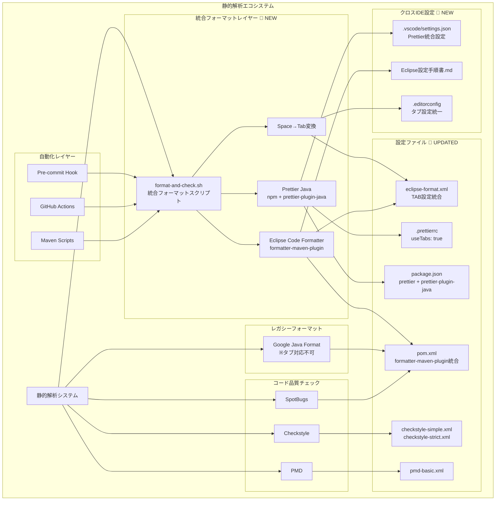

## 各ツールの特徴と役割マトリックス

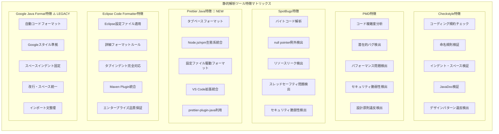
        end
    end
```

## ツール設定レベル構成図

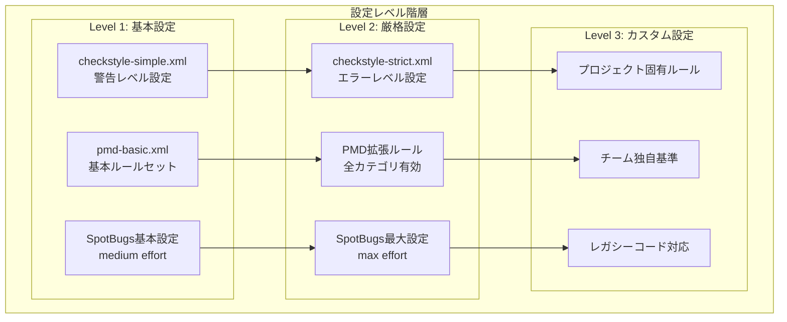

## Checkstyle設定カスタマイズフロー

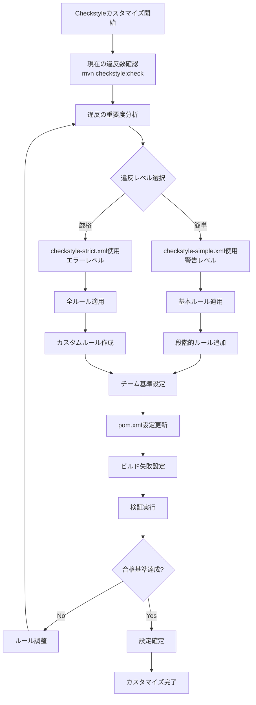

## PMD設定カスタマイズフロー

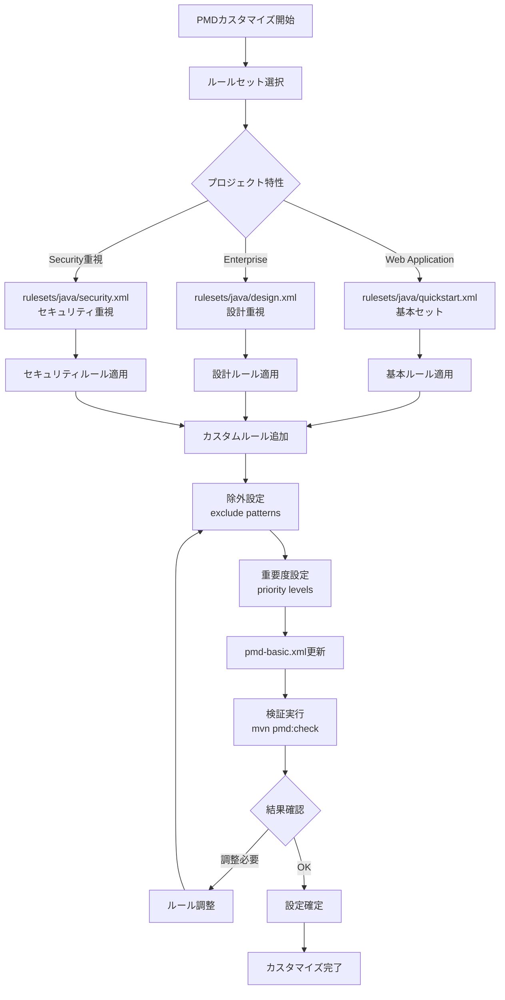

## SpotBugs設定カスタマイズフロー

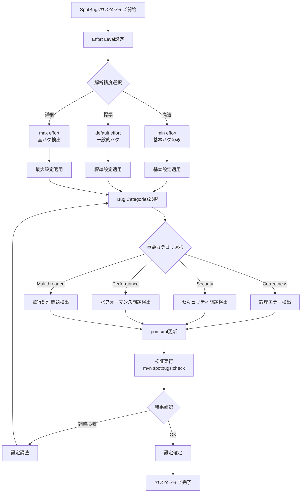

## 統合フォーマット設定カスタマイズフロー 🎨 NEW

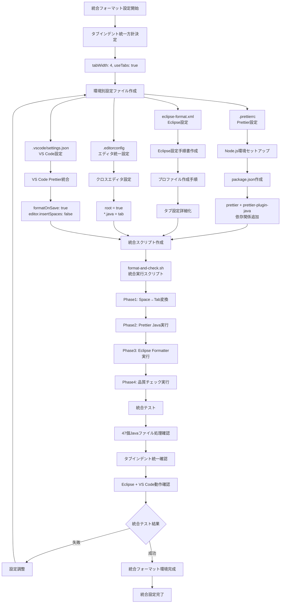

## Google Java Format設定カスタマイズフロー ⚠️ LEGACY

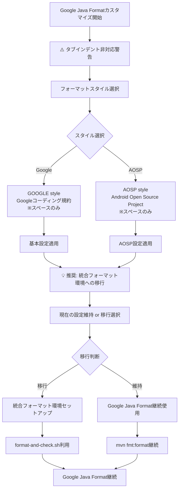

## 自動化設定統合フロー

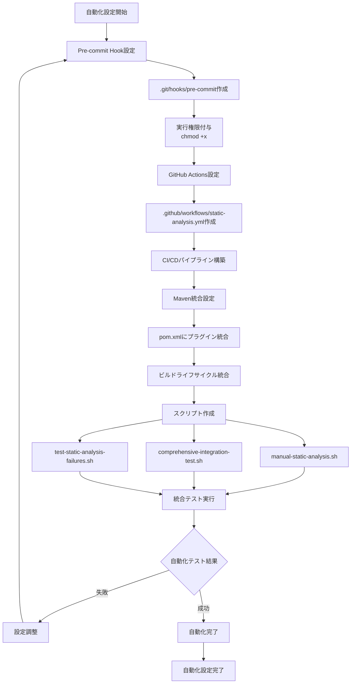

## 設定ファイル依存関係図

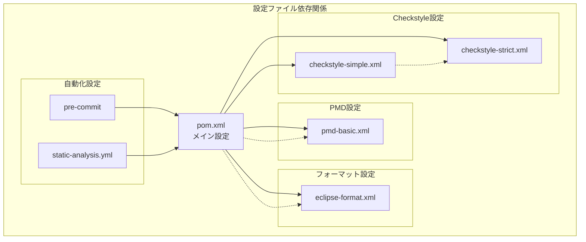

## ツール実行順序とタイミング

```mermaid
gantt
    title 静的解析ツール実行タイミング
    dateFormat X
    axisFormat %s
    
    section Pre-commit
    フォーマット実行          :a1, 0, 1s
    Checkstyle検証           :a2, after a1, 1s
    PMD検証                  :a3, after a2, 1s
    SpotBugs検証             :a4, after a3, 1s
    
    section Build Time
    コンパイル               :b1, 0, 2s
    Checkstyle (simple)      :b2, after b1, 1s
    PMD基本チェック          :b3, after b2, 1s
    SpotBugs基本チェック     :b4, after b3, 1s
    
    section CI/CD
    環境構築                 :c1, 0, 3s
    Checkstyle (strict)      :c2, after c1, 2s
    PMD全ルール              :c3, after c2, 2s
    SpotBugs最大解析         :c4, after c3, 3s
    レポート生成             :c5, after c4, 1s
```

## トラブルシューティングフロー

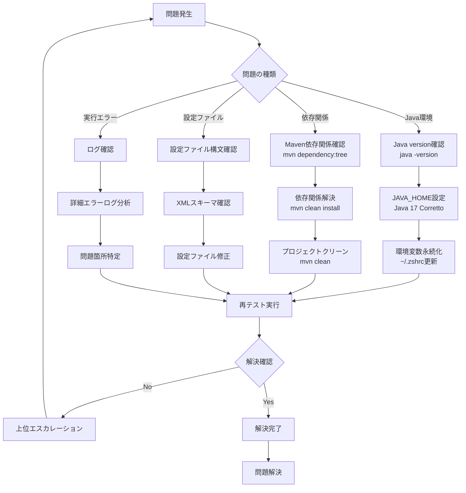

## まとめ

このドキュメントは、DroneInventorySystemプロジェクトにおける静的解析ツールの包括的な設定・カスタマイズガイドです。各ツールの特徴を理解し、プロジェクトの要件に応じて適切な設定を選択・カスタマイズすることで、高品質なコードベースの維持が可能になります。

### 次のステップ
1. 各ツールの設定レベルを段階的に引き上げ
2. チーム固有のルール追加
3. 継続的な品質改善プロセスの確立
4. 定期的な設定見直しとメンテナンス
